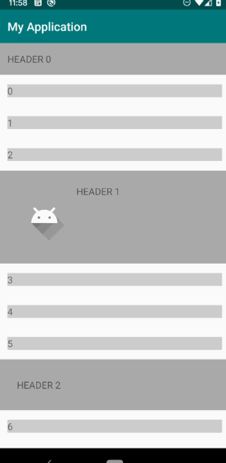

# StickyHeaderDecoration
RecyclerView ItemDecoration to show sticky headers on vertical scrolling lists.
Headers are provided using ViewHolders with support for recycling back to view pool and mixed
header types.



## Usage
Add StickyHeaderDecoration.kt to your project, provide an adapter implementing HeaderAdapter which
has similar pattern to the one for RecyclerViewAdapter.

### Example
```kotlin
// add decoration to recycler
recycler.addItemDecoration(decoration)

// add header adapter to decoration
decoration.headerAdapter = object :
    StickyHeaderDecoration.HeaderAdapter {
    override fun onBindHeaderViewHolder(holder: RecyclerView.ViewHolder, position: Int) {
        holder.itemView.text.text = "HEADER " + position
    }

    override fun onCreateHeaderViewHolder(
        parent: ViewGroup,
        viewType: Int
    ): RecyclerView.ViewHolder {
        // return view holder of the header for the particular type
        val layout = when (viewType){
            0 -> R.layout.example_header
            1 -> R.layout.example_header2
            2 -> R.layout.example_header3
            else -> R.layout.example_header
        }

        val view = LayoutInflater.from(parent.context).inflate(layout, parent, false)
        return Holder(view)
    }

    override fun getHeaderCount(): Int {
      // return number of headers to insert
      return 10
    }

    override fun getHeaderPosition(header: Int): Int {
      // return insertion position of the nth header
      return header * 3
    }

    override fun getHeaderType(header: Int): Int {
        return header % 3;
    }
}
```

# License
     Copyright 2020 Yin Lok Ho
 
     Licensed under the Apache License, Version 2.0 (the "License");
     you may not use this file except in compliance with the License.
     You may obtain a copy of the License at
 
       http://www.apache.org/licenses/LICENSE-2.0
 
     Unless required by applicable law or agreed to in writing, software
     distributed under the License is distributed on an "AS IS" BASIS,
     WITHOUT WARRANTIES OR CONDITIONS OF ANY KIND, either express or implied.
     See the License for the specific language governing permissions and
     limitations under the License.

